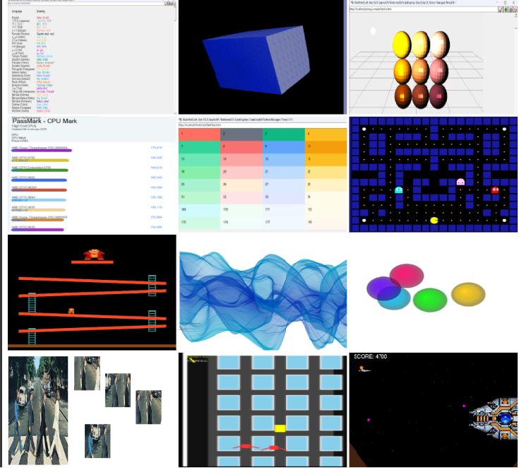

## Project Overview

`MultiHtmlCraft` is a .NET library for HTML parsing, DOM construction, and rendering. It aims to provide a lightweight alternative to full browser engines for server-side or headless client-side processing scenarios.

The library is written in C# and has no dependency on browser engines such as Internet Explorer, Gecko, WebKit, Chromium, or Edge. It supports both Windows and cross-platform builds using conditional compilation and platform-specific dependencies.

The original "fair[dll] V1" project was designed for .NET Framework 1.1 and Mono (Windows and Linux) with JavaScript integration using IKVM (it used its own thread pool). This version is no longer supported or maintained.

The modern "fair[dll] V2" project targets .NET 9 and later. It offers improved performance, modern .NET APIs, and better script engine integration (async/await, `HttpClient`, and other current APIs).

## Supported Web APIs

The following table lists representative Web APIs provided by `MultiHtmlCraft.Core`. Implementation status may change over time; please open an issue or pull request if you need additional APIs or more detailed behavior.

| API | Status | Notes |
|---|---:|---|
| `Document.createElement()` | Implemented | Element creation supported |
| `Document.createTextNode()` | Implemented | Text node creation supported |
| `Document.createEvent()` | Implemented | Basic event creation |
| `Document.querySelector()` | Implemented | CSS selector lookup |
| `Document.querySelectorAll()` | Implemented | Multiple selector lookup |
| `Document.getElementById()` | Implemented | Get element by id |
| `Document.getElementsByClassName()` | Implemented | Get elements by class name |
| `Document.getElementsByTagName()` | Implemented | Get elements by tag name |
| `Element.appendChild()` | Implemented | Append child node |
| `Element.insertBefore()` | Implemented | Insert before reference node |
| `Element.replaceChild()` | Implemented | Replace child node |
| `Element.removeChild()` | Implemented | Remove child node |
| `Element.contains()` | Implemented | Containment check |
| `Element.getBoundingClientRect()` | Implemented | Returns layout rectangle |
| `Element.setAttribute()` / `Element.getAttribute()` | Implemented | Attribute manipulation |
| `DOMParser.parseFromString()` | Implemented | Parse string to DOM |
| `CSStyleSheet.addRule()` | Implemented | Add basic CSS rule |
| `HTMLCanvasElement.getContext("2d")` | Implemented | Canvas 2D API available |
| `MediaElement` | audio support Implemented | video no-op at present |
| `WebGLContext` | Present (limited) | Mostly no-op at present |
| `AudioContext` | Present (limited) | Mostly no-op at present |
| `XMLHttpRequest` | Implemented (basic) | Basic GET/POST, headers, events (`readyState`, `onload`, `onerror`, etc.) |
| Window basic events (`load`, `resize`, `click`, etc.) | Implemented (basic) | Event listener registration and dispatch supported |
| `Element.addEventListener()` / `Element.removeEventListener()` | Implemented | DOM event handling supported |
| CSSOM (reading styles, partial manipulation) | Partial | Not fully spec-complete but major features available |

## Solution structure

- `MultiHtmlCraft.Core` — Core library (targets: `net9.0;net9.0-windows`)
- `ClearScriptProcessor` — Script processing integration (referenced)
- `NilJsProcessor` — JavaScript processing/emulation (referenced)
- `MultiHtmlCraft.Interfaces` — Shared interfaces (referenced)

See the solution explorer for the full project list and references.

## Layout Engine & Architecture

- Modular architecture with clear separation of concerns: parsing, DOM, rendering, and scripting.
- The core library (`MultiHtmlCraft.Core`) handles HTML parsing, DOM modeling, and rendering abstractions.
- Script engine integrations are provided by separate projects that implement the `IScriptProcessor` interface.
- The rendering front-end requires further layout engine needs many improvements.

## Key settings & dependencies

- Target frameworks: `net9.0;net9.0-windows`.
- The current default script processor for `MultiHtmlCraft.Core` is JavaScript.
- Windows-specific build defines `WINDOWS;WINFORMS` and sets `UseWindowsForms` when targeting `net9.0-windows`.
- Notable NuGet packages (from `MultiHtmlCraft.Core.csproj`):
  - `SkiaSharp`
  - `Avalonia.Skia`
  - `Svg`
  - `System.Drawing.Common`
  - `NLog`

## Script Engine Integration

- Script engine integrations should implement the `IScriptProcessor` and `IScriptScope` interfaces.
- For security reasons, HTTP/HTTPS scripts must be downloaded and executed only from pre-registered, authorized, trusted hosts.
- Currently supported script engines:
  - ClearScript V8 (via the `ClearScriptProcessor` project)
  - NilJS (via the `NilJsProcessor` project)
- Variables and functions may be exposed to the script engine's scope via `IScriptScope` methods to enable interaction between scripts and the DOM.

## GUI Platforms

- WinForms is supported on Windows (GDI). Avalonia support for cross-platform GUI for MacOS, Linuex rendering is almost compmpleted.
- Due to Windows GDI limitations, some Canvas 2D APIs are not available on the WinForms platform.
- Skia-based rendering is under development for headless and cross-platform scenarios.

Other GUI platforms may be supported in future releases.

## Build (local)

Command line:
- Restore and build:
  - `dotnet restore`
  - `dotnet build -c Release`
- Build the solution explicitly:
  - `dotnet build MultiHtmlCraft.Core.sln -c Release`

Visual Studio:
- Open the solution, then use the menu Build > Build Solution.

Notes:
- When building for Windows-specific features, choose the `net9.0-windows` TFM.

## Tests

Run unit tests (if present):
- `dotnet test`
- For no-build test runs: `dotnet test --no-build`

## Running / Rendering

- WinForms, Avalonia (in development), and Skia-based rendering are supported or under development.

## Font management

- Built-in font cache and APIs to enumerate and register custom fonts on non-Windows platforms.
- If your application exposes font upload endpoints or APIs, document accepted formats and any size limits.

## Packaging & publishing

- Create NuGet packages with `dotnet pack`.
- Publish with `dotnet nuget push` or GitHub Packages.
- Versioning follows `Version`, `AssemblyVersion`, and `FileVersion` in project files (example: `0.90.10`).

## Contributing

- Open issues for bugs and feature requests.
- Send focused pull requests with tests and clear descriptions.
- Follow project code conventions and `Nullable` settings (`<Nullable>enable</Nullable>`).

## License

- MIT License. See the `LICENSE` (MIT License) file for details.

## Common commands

- Add and commit README:
  - `git add README.md && git commit -m "Add solution README" && git push`
- Clean and rebuild:
  - `dotnet clean && dotnet build -c Release`

## Contact / Repository

- Repository: https://github.com/commonsuppliz/MultiHtmlCraft
